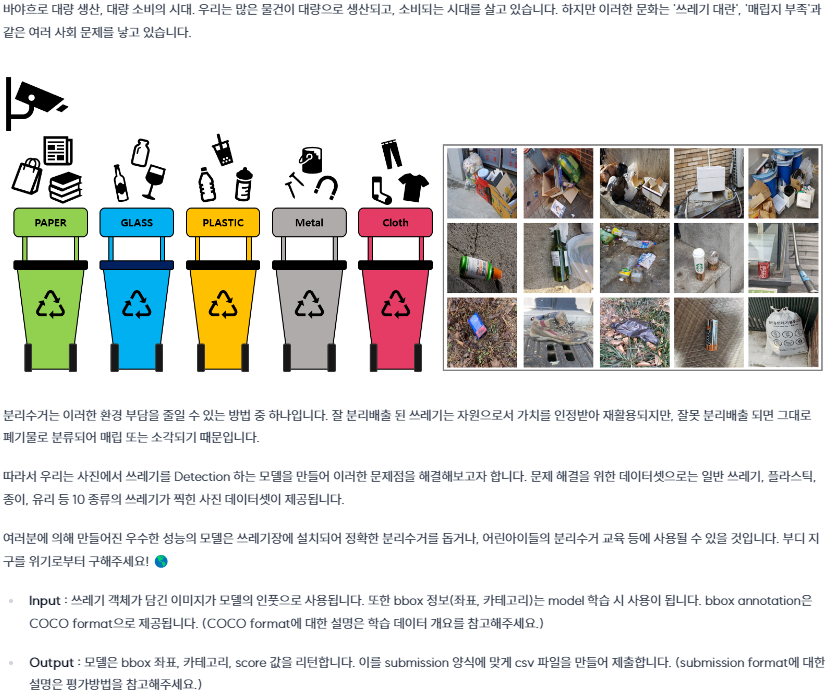

# 📖 Overview
<!-- 재활용 품목 분류를 위한 Object Detection -->



# 🗂 Dataset


<center>

<div align="center">
  <sup>Example image data w/ 2D Bounding Boxes, annotation data
</sup>
</div>
</center>


- **Images & Size :**   (Train), 4871 (Test), (1024, 1024)
- **Classes :** General trash, Paper, Paper pack, Metal, Glass, Plastic, Styrofoam, Plastic bag, Battery, Clothing
<!-- - **Annotations :** Image size, class,  -->

<!-- <br/> -->
# Team CV-01

## 👬🏼 Members
<table>
    <tr height="160px">
        <td align="center" width="150px">
            <a href="https://github.com/boyamie"></a>
            <br/>
            <a href="https://github.com/boyamie"><strong>김보현</strong></a>
            <br />
        </td>
        <td align="center" width="150px">
            <a href="https://github.com/kimmaru"></a>
            <br/>
            <a href="https://github.com/kimmaru"><strong>김성주</strong></a>
            <br />
        </td>
        <td align="center" width="150px">
            <a href="https://github.com/Haneol-Kijm"></a>
            <br/>
            <a href="https://github.com/Haneol-Kijm"><strong>김한얼</strong></a>
            <br />
        </td>
        <td align="center" width="150px">
            <a href="https://github.com/Namgyu-Youn"></a>
            <br />
            <a href="https://github.com/Namgyu-Youn"><strong>윤남규</strong></a>
            <br />
        </td>
        <td align="center" width="150px">
            <a href="https://github.com/suhyun6363"></a>
            <br />
            <a href="https://github.com/suhyun6363"><strong>정수현</strong></a>
            <br />
        </td>
        <td align="center" width="150px">
              <a href="https://github.com/minseokheo"></a>
              <br />
              <a href="https://github.com/minseokheo"><strong>허민석</strong></a>
              <br />
          </td>
    </tr>
</table>


## 👩‍💻 Roles

|Name|Roles|
|:-------:|:--------------------------------------------------------------:|
|Common| Model Training, Hypothesis test         |
|김보현| |
|김성주| |
|김한얼| Construct pipeline, Code Refactorization, Schedule managemenet, Workfload manaagement |
|윤남규| Research tools, Data curation & augmentation, Pipeline refatorization |
|정수현| Model search, Hyperparameter tuning, Data augmentation|
|허민석| Model search, Hyperparameter tuning, Data augmentation|


</br>

## 💻 Enviroments

- Language: Python 3.10
- Hardwares: Tesla V100-SXM2 32GB × 6
- Framework: Pytorch, Detectron2 v0.6, YOLO11X Ultralytics, MMDetection v2.2.0
- Cowork Tools: Github, WanDB, Notion, Zoom, Google drive

</br>

# 📊 Project
## 🔎 EDA

<!-- <center>

</center> -->


> ### Class Imbalance, Object Size

<center>

<div align="center">
  <sup>Distribution of Bbox area as % of Image area by class
</sup>
</div>
</center>


- 전체적인 데이터의 분포가 불균형을 이룸. Sample 갯수가 159개인 category(9)가 존재함.
- 각 클래스 별 객체의 크기 분포는 작은 순으로 큰 객체로 갈 수록 줄어듦

</br>

> ### Object Position

<center>

<div align="center">
  <sup>Object Bounding Box distribution of each class
</sup>
</div>
</center>


- 이미지 상의 객체들이 이미지의 중심부에 주로 위치하고 있음
</br>

## 🔗 Pipeline
<center>

<div align="center">
  <sup>Pipeline of Applied Methods
</sup>
</div>
</center>


## 🔬 Methods

<!-- 전체 파이프라인 이미지 및 methods 설명 -->
> ### Data Cleaning
- 데이터 시각화를 통해 다수의 레이블 오류가 발견되어 Supervisely를 활용해 데이터 레이블 수정 후 실험 진행
- 실험 결과 수정한 데이터셋이 기존의 데이터셋보다 낮은 성능 결과를 보임
- 이는 Test dataset과 train dataset 모두 유사한 오류 경향성을 가지는 것으로 추정되어 수정하지 않은 Original dataset으로 이후 실험을 진행

<!-- 실험 결과 표 -->
| Dataset | Model | Backbone | mAP_50(Val) | mAP_50(Test) |
|:-----------:|:---------:|:------------:|:---------:|:---------------------------:|
|   Original  |    Dino   |    Swin-l    |   0.716   |            0.6938           |
|  Relabeled  |    Dino   |    Swin-l    |   0.582   |            0.6488           |

</br>


> ### Reclassify General Trash Class


<center>

<div align="center">
  <sup>Annotation per class in Class-20 Train Dataset
</sup>
</div>
</center>

</br>


- EDA를 통해 General Trash 클래스 이미지들이 다양한 객체로 이루어져 있음을 발견
- General Trash 클래스를 10개의 클래스로 추가 분류하여 총20개의 클래스로 이루어진 Class-20 데이터셋으로 재구성함
- Class-20의 General trash 클래스 중 높은 mAP를 보인 3개의 클래스를 선정해 12개의 클래스로 이루어진 Class-12, 13개의 클래스로 이루어진 Class-13 데이터셋으로 재구성함
- 실험 결과 클래스를 추가하여 검출한 경우보다 기존의 Original 성능과 비슷하거나 낮음
- 이는 General class에 다양한 종류의 객체들이 있음에도 불구하고 모델이 충분히 학습 및 추론이 가능한 것으로 판단
<!-- 실험 결과 표 -->

| **Dataset** | **Model** | **Backbone** | **Epochs** | **mAP_50(Test)** |
|:-----------:|:---------:|:------------:|:----------:|:---------------------------:|
|   Original  |    Dino   |    Swin-l    |     23     |            0.717            |
|   Class-20  |    Dino   |    Swin-l    |     23     |            0.679            |
|   Class-12  |    Dino   |    Swin-l    |     23     |            0.673            |
|   Class-13  |    Dino   |    Swin-l    |     23     |            0.711            |


</br>

> ### Deblur
- EDA를 통해 Train 및 Test dataset에 blur image 다수 발견함
- 이를 분류 한 결과 Train 21.89% Test 22.02% blurred image 존재함
- 이들을 deblurr를 통해 보정 후 학습에 사용하였으나 유의미한 성능 향상 없음
<center>

</center>

</br>

| Dataset | Model | Backbone | mAP_50(Val) | mAP_50(Test)
|:-----------:|:---------:|:--------------------:|:------------------:|:------------------:|
|   Original  |    Dino   |    Swin-l    |   0.716   | 0.6938 |
|  Deblurred  |    Dino   |    Swin-l    |   0.704   | 0.6825 |

</br>


> ### Super Resolution
 - EDA를 통해 작고 흐릿한 이미지들을 다수 발견함
 - Enhanced Deep Residual Networks for Single Image Super-Resolution에 제안된 SR 기법을 적용하여 2배 해상도의 이미지로 변환함
 - 해당 이미지를 Center-crop 또는 Multi-crop 수행한 뒤 이를 기존 데이터셋과 합께 학습 데이터로 활용함
 - 실험 결과 1개의 이미지만 추가로 사용하는 Center-crop에 비해 4배의 학습 데이터를 사용하는 Multi-crop 방식에서 높은 성능 개선을 확인할 수 있음

<center>

<div align="center">
  <sup>Center-Crop</sup>
</div>
</center>


<center>

<div align="center">
    <sup>Multi-Crop</sup>
</div>
</center>


<!-- <center>  -->

| Dataset            | Model | Backbone | Epoch | mAP_50(Val) | mAP_50(Test)
|:-------:|:----------:|:-----------------------:|:-------:|:---------:|:---------:|
| Original           | DINO  | Swin-l   | 20    | 0.731   | 0.7172 |
| Original+SR(Center-Crop)      | DINO  | Swin-l   | 25    | 0.802   | 0.721 |
| Original+SR(Multi-Crop) | DINO  | Swin-l   | 25    | 0.817   |  0.7398 |

<!-- </center> -->


</br>

> ### Augmentation
- 객체들의 크기 및 위치를 고려했을 때 RandomResize, RandomCrop, RandomAugment 방법을 적용했을 때 성능 개선을 기대함
- 학습시 모델의 일반화를 높이기 위한 방법으로 다양한 증강 기법을 적용한 뒤, 여러 평가 지표를 기반으로 증강 기법을 선정함
- 기하학적 변환을 적용할 경우 IoU 임계값에 따라 mAP가 크게 달라지는 경향을 보여줌
- 색상 변환에 대한 RandAugment 기법을 적용한 결과 강건하고 높은 성능 향상을 보여줌

| **Augmentation**      | **Info**                 | **mAP_50(Val)** |
|:-----------------------:|:--------------------------:|:-----------:|
| None                  | -                        | 0.554     |
| RandomCrop            | RandomCrop               | 0.565     |
| RandomCenterCropPad   | CenterCrop + pad         | 0.568     |
| RandomAffine          | Geometric transformation | 0.561     |
| PhotoMetricDistortion | Color Jitter             | 0.564     |
| RandAugment           | Color transformation     | 0.571     |


</br>


> ### Models
- 1-stage, 2-stage 모델부터 레거시 및 최신 모델을 활용함
- YOLO 등의 1-stage 모델의 경우 낮은 객체 검출 성능을 보임
- 최근 연구로 제안된 DINO, Co-Detr과 같은 모델들을 학습 및 평가함
```bash
Frameworks : Detectron2 v0.6, Ultralytics v8.1, mmDetection v3.3.0
```

<center>

<div align="center">
<!--   <sup>Test dataset(Public) -->
</sup>
</div>
</center>


<!-- |    Framework   |     Model    |   Backbone   | Val mAP50 |
|:--------------:|:------------:|:------------:|:---------:|
| Detectron 2    | Faster RCNN  | R50          |   0.450   |
|                | Cascade RCNN |              |   0.452   |
| Yolo v8        | Yolo v8m     | CSPDarknet53 |   0.414   |
|                | Yolo v8x     |              |   0.474   |
| mmDetection v3 | Cascade RCNN | R50          |   0.458   |
|                |              | ConvNext-s   |   0.554   |
|                |              | Swin-t       |   0.512   |
|                | DDQ          | R50          |   0.560   |
|                |              | Swin-l       |   0.677   |
|                | DINO         | R101         |   0.580   |
|                |              | Swin-l       |   0.719   |
|                | Co-Detr      | Swin-l       |   0.717   |
 -->

</br>


> ### Ensemble
- Confusion Matrix로 모델별 특징을 파악하여 모델 조합을 판단함
- WBF (Weighted Box Fusion) 기법 적용 하였으나 유의미한 성능 향상 없음
- 단일 모델의 성능이 앙상블 기법보다 높음

| Models                   | Average mAP_50(Val) | Ensemble mAP_50(Test) |
|:-------------------------------:|:-------------:|:-----------------:|
| YOLO + Cascade (R50 + ConvNeXt) | 0.5123      | 0.6061       |
| DINO + DDQ + Co-detr    | 0.6761      | 0.5911       |


</br>

# 📈 Experimental Result

<!-- > ### mAP_50 Test Score Trend Graph -->

<center>

<div align="center">
    <sup> mAP_50 Test dataset(Public) </sup>
</div>
</center>
